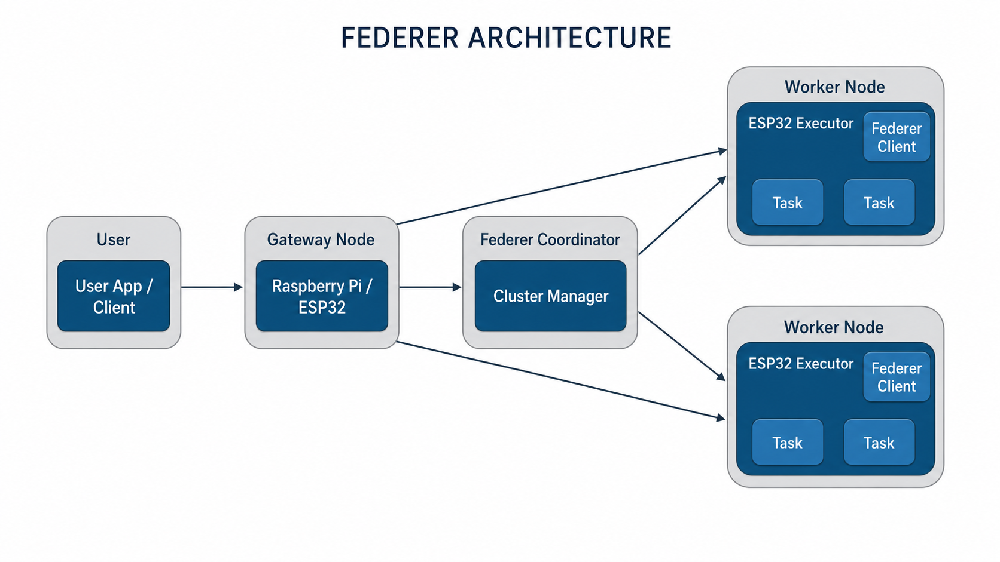

<div align="center">


# Federer

**Plano de control tipo `kubectl` para un mini-cluster de ESP32 que entrena de dos formas: _aprendizaje federado_ (FedAvg) y _gossip learning_.**

_Como el tenista: **Fed**erated + Federer._ 🎾

[](https://www.python.org/)
[](https://www.espressif.com/)
[](https://platformio.org/)
[](https://mosquitto.org/)
[](#-dos-modos-de-entrenamiento)
[](#-dos-modos-de-entrenamiento)
[](#-panel-web)
[](LICENSE)

</div>

---

## 📑 Tabla de contenidos

- [¿Qué es Federer?](#-qué-es-federer)
- [Características](#-características)
- [Dos modos de entrenamiento](#-dos-modos-de-entrenamiento)
- [Panel web](#-panel-web)
- [Arquitectura](#-arquitectura)
- [Requisitos](#-requisitos)
- [Setup paso a paso](#-setup-paso-a-paso)
- [Uso](#-uso)
- [Comandos del CLI](#-comandos-del-cli)
- [Protocolo MQTT](#-protocolo-mqtt)
- [Métricas y resultados](#-métricas-y-resultados)
- [Estructura del repositorio](#-estructura-del-repositorio)
- [Documentación](#-documentación)
- [Roadmap](#-roadmap)
- [Licencia](#-licencia)

---

## 🎾 ¿Qué es Federer?

**Federer** es una herramienta de línea de comandos que convierte un puñado de placas **ESP32** en un **mini-cluster de aprendizaje distribuido en el borde**. En lugar de mandar los datos a un servidor central, **cada ESP32 entrena un modelo localmente con sus propios datos** y solo comparte los *pesos* del modelo. Federer es el **plano de control** (al estilo `kubectl`): descubre nodos, les envía hiperparámetros, **elige el modo de entrenamiento**, los graba por red (**OTA**, sin cable) y registra todas las métricas.

El mismo firmware soporta **dos modos** que Federer activa con un solo mensaje:

- 🟢 **Config A — FedAvg (aprendizaje federado):** coordinado por un maestro, por rondas.
- 🔵 **Config B — Gossip (gossip learning):** descentralizado, sin maestro, los nodos se fusionan entre vecinos.

El caso de ejemplo es una **regresión lineal** sobre el dataset *Crop Recommendation*: cada nodo predice el potasio (**K**) del suelo a partir de `N`, `P`, `temperatura`, `humedad`, `pH` y `lluvia`.

> 🧠 **En una frase:** los datos nunca salen del dispositivo; solo viajan los pesos del modelo.

---

## ✨ Características

- 🛰️ **Plano de control tipo `kubectl`** — descubre, inspecciona y administra nodos desde un menú interactivo en la terminal.
- 🖥️ **Panel web ligero** (estilo Docker Desktop / Airflow) — ve y configura todo el cluster visualmente desde el navegador.
- 🔀 **Dos modos de entrenamiento** en el mismo firmware — FedAvg (centralizado) y gossip (descentralizado), conmutables vía MQTT.
- 🤝 **Aprendizaje federado (FedAvg)** con *momentum* — agregación ponderada por número de muestras de cada nodo.
- 🗣️ **Gossip learning** — entrenamiento autónomo y fusión peer-to-peer de pesos, sin punto único de fallo.
- 📡 **Grabado OTA** — actualiza el firmware de los ESP32 **por Wi-Fi**, sin volver a conectar el USB.
- 📊 **Telemetría y métricas en vivo** — heap, RSSI, MSE/RMSE, tiempo de entrenamiento, intercambios de gossip y consenso, exportados a CSV.
- 🔌 **Provisión automática** — genera la partición de datos de cada nodo (`datos_nodo.h`) y graba el firmware con un comando.
- 🖥️ **Dashboard en terminal** con [Rich](https://github.com/Textualize/rich) — tabla de nodos refrescada en vivo.

---

## 🔀 Dos modos de entrenamiento

Federer envía `cluster/mode` y todos los nodos cambian de comportamiento al instante. Un mismo firmware (`FW_VER = 3.0-AB`) implementa ambos.

| | 🟢 **Config A — FedAvg** | 🔵 **Config B — Gossip** |
|---|---|---|
| **Topología** | Maestro ↔ nodos (estrella) | Nodos ↔ nodos (malla) |
| **Coordinación** | Federer dirige cada ronda | Autónoma, sin maestro |
| **Entrenamiento** | Reactivo: al recibir el modelo global | Continuo: una época cada ~150 ms |
| **Intercambio** | Nodo → maestro (`fedavg/update`) | Nodo → vecino aleatorio (`gossip/inbox/<id>`) |
| **Agregación** | $w = \frac{\sum n_k w_k}{\sum n_k}$ en el host | $w \leftarrow \frac{w_{local} + w_{vecino}}{2}$ en cada nodo |
| **Fin** | Converge por rondas (`‖Δw‖ < ε`) | Por tiempo; converge al consenso |
| **Punto único de fallo** | Sí (el maestro) | No |
| **Métricas** | `convergencia_fedavg.csv` | `gossip_consenso.csv`, `gossip_nodos.csv` |

> 🟢 **FedAvg** es ideal para experimentos reproducibles y comparables ronda a ronda.
> 🔵 **Gossip** es más robusto y realista para redes sin un coordinador fiable.

Ver detalle en [FedAvg](docs/fedavg.md) y [Gossip learning](docs/gossip.md).

---

## 🖥️ Panel web

Además de la CLI, Federer trae un **panel web ligero** (estilo Docker Desktop / Apache Airflow)
para ver y configurar todo el cluster **desde el navegador**: estado de nodos en vivo, lanzar
FedAvg/gossip con gráficas de convergencia y consenso, cambiar hiperparámetros y modo, y grabar
firmware (USB/OTA).

> 🪶 **Sin dependencias extra:** el backend usa solo la librería estándar de Python
> (`http.server`) y reutiliza el mismo `Manager` MQTT; el frontend es HTML/CSS/JS vanilla
> (sin build, sin CDN). Funciona offline en la LAN.

Se lanza **explícitamente** (no arranca solo):

```bash
python federer.py --web                 # modo dedicado, abre http://localhost:8770
python federer.py --web --port 9000     # otro puerto
python federer.py --web --no-browser    # sin abrir el navegador
```

…o desde el menú interactivo con la opción **`web`** (lo levanta en segundo plano y vuelve al
menú). Detalle completo en la [documentación del panel](docs/web-ui.md).

---

## 🏗️ Arquitectura

<div align="center">

</div>

```text
                 ┌──────────────────────────────────────────────┐
                 │                  FEDERER (host)              │
                 │     Raspberry Pi / Jetson / laptop           │
                 │  ┌────────────┐        ┌──────────────────┐  │
                 │  │ federer.py │◀──────▶│  Mosquitto :1883 │  │
                 │  │ (control)  │  MQTT  │   (broker)       │  │
                 │  └────────────┘        └──────────────────┘  │
                 └───────────────────────────┬──────────────────┘
                                              │  Wi-Fi (MQTT + OTA)
              ┌───────────────┬───────────────┼───────────────┐
              ▼               ▼               ▼               ▼
        ┌──────────┐   ┌──────────┐    ┌──────────┐    ┌──────────┐
        │ ESP32 #0 │◀─▶│ ESP32 #1 │◀──▶│ ESP32 #2 │◀──▶│ ESP32 #N │
        │ datos #0 │   │ datos #1 │    │ datos #2 │    │ datos #N │
        └──────────┘   └──────────┘    └──────────┘    └──────────┘
         entrena local  entrena local   entrena local   entrena local
              └──── gossip peer-to-peer (Config B) ──────┘
```

- **Plano de control (MQTT):** `cluster/announce`, `cluster/discover`, `cluster/config`, `cluster/cmd`, `cluster/mode`.
- **Plano de datos:** `fedavg/global` + `fedavg/update` (Config A) y `gossip/inbox/<id>` + `gossip/report` (Config B).

---

## 📋 Requisitos

**En el host (donde corre Federer):**

- Python **3.9+**
- Un broker MQTT — [Mosquitto](https://mosquitto.org/) recomendado
- [PlatformIO Core](https://platformio.org/) (`pio`) para grabar el firmware
- Paquetes Python: `paho-mqtt`, `rich`, `numpy`, `pandas`, `scikit-learn`, `platformio` (y `kagglehub` si descargas el dataset automáticamente)

**En los nodos:**

- Placas **ESP32** (probado con `esp32dev`)
- Cable USB para la **primera** grabación (luego todo es OTA)
- Una red Wi-Fi compartida con el host

---

## 🚀 Setup paso a paso

### 1. Clonar el repositorio

```bash
git clone https://github.com/Vallit0/federer.git
cd federer
```

### 2. Instalar dependencias de Python

```bash
# (opcional pero recomendado) entorno virtual
python -m venv .venv
# Linux / macOS:
source .venv/bin/activate
# Windows (PowerShell):
.venv\Scripts\Activate.ps1

pip install -r requirements.txt
```

### 3. Levantar el broker MQTT

Federer se conecta por defecto a `localhost:1883`.

```bash
# Linux (Debian/Ubuntu)
sudo apt install mosquitto mosquitto-clients
sudo systemctl enable --now mosquitto

# macOS (Homebrew)
brew install mosquitto && brew services start mosquitto

# Windows: instala Mosquitto desde https://mosquitto.org/download/
```

> 💡 Si el broker está en otra máquina, edita `BROKER` y `PUERTO` al inicio de `federer.py`.

### 4. Configurar el firmware del ESP32

Edita las credenciales en `firmware_esp32/src/main.cpp`:

```cpp
const char* WIFI_SSID = "TU_RED_WIFI";
const char* WIFI_PASS = "TU_PASSWORD";
const char* BROKER_IP = "192.168.1.100";   // IP del host donde corre el broker
const char* OTA_PASS  = "federer";          // clave para grabar por red
```

> El proyecto PlatformIO ya está en `firmware_esp32/` con los entornos `esp32dev` (USB) y `esp32ota` (red). El firmware soporta los dos modos (A/B); no hay que regrabar para cambiar de modo.

### 5. Lanzar Federer

```bash
python federer.py            # menú interactivo (CLI)
python federer.py --web      # panel web en el navegador (UI visual)
```

### 6. Provisionar tu primer nodo

1. Conecta un ESP32 por **USB**.
2. En el menú escribe `provision` (opción `5`).
3. Asigna un `NODE_ID`, el tamaño del cluster `N` y el puerto USB.
4. Federer genera la partición de datos del nodo (`datos_nodo.h`), crea `prueba.csv` y graba el firmware.

Repite para cada placa. A partir de la segunda grabación puedes usar **`ota`** (opción `6`) y actualizar por Wi-Fi.

### 7. Entrenar

Con los nodos en línea (verifícalo con `nodes`), ejecuta `train` (opción `7`) y elige la **configuración**:

- **A** → experimento **FedAvg** por rondas.
- **B** → experimento **gossip** por tiempo (te pide duración y periodo de gossip).

Revisa los resultados con `metrics` (opción `8`).

---

## 🕹️ Uso

Al arrancar verás el menú interactivo:

```text
 1) nodes      ver nodos del cluster (en vivo)
 2) discover   descubrir nodos ahora
 3) describe   detalle de un nodo
 4) config     enviar hiperparametros (lr/beta/epocas)
 5) provision  grabar un ESP32 nuevo (USB, primera vez)
 6) ota        actualizar firmware por red (sin cable)
 7) train      correr experimento (A=FedAvg / B=gossip)
 8) metrics    revisar metricas guardadas
 9) reboot     reiniciar / resetear un nodo
 0) quit       salir
```

---

## ⌨️ Comandos del CLI

| Comando | Alias | Qué hace |
|---|---|---|
| `nodes` | `1` | Tabla de nodos en vivo (estado, IP, MAC, muestras, heap, RSSI, ronda, MSE). |
| `discover` | `2` | Envía un ping de descubrimiento a todos los nodos. |
| `describe` | `3` | Muestra el detalle completo (JSON) de un nodo. |
| `config` | `4` | Envía hiperparámetros `lr`, `beta` y `epocas` al cluster. |
| `provision` | `5` | Graba un ESP32 nuevo por **USB** y genera su partición de datos. |
| `ota` | `6` | Actualiza el firmware **por red** de uno o todos los nodos online. |
| `train` | `7` | Corre un experimento: **A = FedAvg** (rondas) o **B = gossip** (por tiempo). |
| `metrics` | `8` | Lista y previsualiza los CSV de métricas. |
| `reboot` | `9` | Reinicia (`reboot`) o resetea pesos (`reset`) de un nodo. |
| `quit` | `0` | Sale de Federer. |

---

## 📡 Protocolo MQTT

| Tópico | Dirección | Carga útil |
|---|---|---|
| `cluster/announce` | nodo → Federer | Identidad + telemetría + `mode` (heartbeat cada 5 s). |
| `cluster/discover` | Federer → nodos | Ping de descubrimiento. |
| `cluster/config` | Federer → nodos | `{lr, beta, epocas}` |
| `cluster/cmd` | Federer → nodos | `{cmd:"reboot"\|"reset", node:id\|-1}` |
| `cluster/mode` | Federer → nodos | `{mode:"fedavg"\|"gossip"\|"idle", peers[], t_gossip, report}` |
| `fedavg/global` | Federer → nodos | `{round, w[], stop}` modelo global (Config A). |
| `fedavg/update` | nodo → Federer | `{node, round, n, w[], mse, rmse, train_ms, heap, rssi}` (Config A). |
| `gossip/inbox/<id>` | nodo → nodo | `{from, w[]}` pesos enviados a un vecino (Config B). |
| `gossip/report` | nodo → Federer | `{node, w[], mse, exch, heap, rssi}` (Config B). |

---

## 📊 Métricas y resultados

Federer guarda los resultados en CSV en el directorio de trabajo:

| Archivo | Modo | Contenido |
|---|---|---|
| `convergencia_fedavg.csv` | A | `ronda, rmse_global, dw, n_nodos` — convergencia por ronda. |
| `metricas_fedavg.csv` | A | Métricas por nodo y ronda (MSE, RMSE, `train_ms`, heap, RSSI). |
| `gossip_consenso.csv` | B | `ts, t_rel, rmse_prom, dispersion, n_nodos` — consenso global en el tiempo. |
| `gossip_nodos.csv` | B | `ts, t_rel, node, rmse_local, exch` — estado por nodo (con nº de fusiones). |
| `telemetria_cluster.csv` | A/B | Telemetría de cada `announce` (IP, MAC, heap, RSSI, firmware, hiperparámetros). |

Todos son legibles con `pandas` o Excel para graficar la convergencia, el consenso y comparar nodos.

---

## 📁 Estructura del repositorio

```text
federer/
├── federer.py                 # Plano de control (CLI + MQTT + FedAvg + gossip)
├── federer_web.py             # Backend del panel web (solo stdlib + Manager)
├── webui/                     # Frontend del panel (HTML/CSS/JS vanilla)
│   ├── index.html
│   ├── style.css
│   ├── app.js
│   └── logo.png
├── firmware_esp32/            # Proyecto PlatformIO del nodo ESP32 (firmware 3.0-AB)
│   ├── platformio.ini         # Entornos esp32dev (USB) y esp32ota (red)
│   ├── src/main.cpp           # Firmware del nodo: 2 modos (FedAvg + gossip) + OTA
│   └── include/datos_nodo.h   # Partición de datos (la genera Federer)
├── docs/                      # Documentación MkDocs
│   └── assets/                # Logo y diagrama de arquitectura
├── mkdocs.yml                 # Configuración del sitio
├── requirements.txt           # Dependencias de Python
├── requirements-docs.txt      # Dependencias de la documentación
└── README.md
```

---

## 📚 Documentación

La documentación completa se construye con **MkDocs Material**:

```bash
pip install -r requirements-docs.txt
mkdocs serve     # http://127.0.0.1:8000
mkdocs build     # genera el sitio estático en site/
```

Para publicar en **GitHub Pages**:

```bash
mkdocs gh-deploy
```

---

## 🗺️ Roadmap

- [ ] Soporte para modelos no lineales (MLP cuantizado).
- [ ] Topologías de gossip configurables (anillo, vecinos fijos, k-aleatorios).
- [ ] Autenticación TLS en el broker MQTT.
- [ ] Panel web de métricas en tiempo real (FedAvg y consenso de gossip).
- [ ] Tolerancia a nodos caídos a mitad de ronda en FedAvg.

---

## 📄 Licencia

Distribuido bajo licencia **MIT**. Consulta [`LICENSE`](LICENSE).

<div align="center">

Hecho con 🎾 para experimentar con aprendizaje federado y gossip en el borde.

</div>
