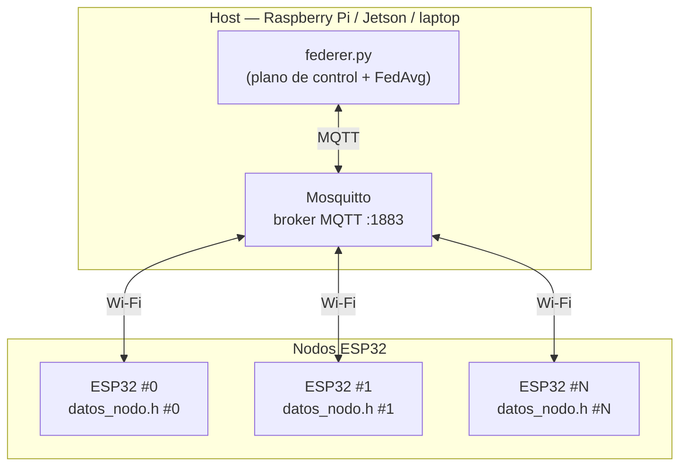
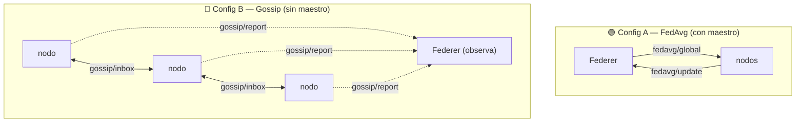
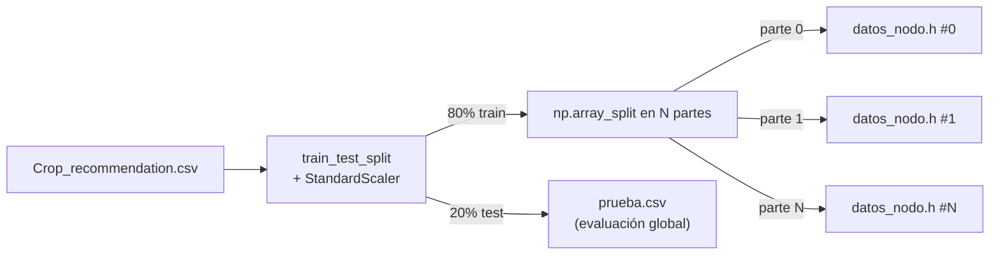

# Arquitectura

Federer separa claramente el **plano de control** (administración del cluster) del
**plano de datos** (entrenamiento), ambos sobre MQTT. El plano de datos cambia según el
[modo de entrenamiento](modos.md) activo: **FedAvg** (con maestro) o **gossip** (peer-to-peer).

## Componentes

| Componente | Rol |
|---|---|
| **`federer.py`** | CLI interactivo + cliente MQTT + orquestador FedAvg/gossip + generador de particiones. |
| **Broker MQTT** | Bus de mensajes entre el host y los nodos (Mosquitto). |
| **Firmware ESP32** | Agente de cluster + ArduinoOTA + entrenamiento local (FedAvg **y** gossip). |
| **`datos_nodo.h`** | Partición de datos embebida, única por nodo (la genera Federer). |
| **CSV de métricas** | Registro persistente de convergencia, métricas por nodo y telemetría. |

## Los dos planos

### Plano de control

Gestiona el ciclo de vida del cluster: descubrimiento, configuración y comandos.

| Tópico | Dirección | Propósito |
|---|---|---|
| `cluster/announce` | nodo → Federer | Heartbeat con identidad, telemetría y modo activo. |
| `cluster/discover` | Federer → nodos | Solicita que todos se anuncien. |
| `cluster/config` | Federer → nodos | Cambia `lr`, `beta`, `epocas`. |
| `cluster/cmd` | Federer → nodos | `reboot` / `reset`. |
| `cluster/mode` | Federer → nodos | Selecciona el modo: `fedavg` / `gossip` / `idle`. |

### Plano de datos

Cambia según el modo de entrenamiento.

| Tópico | Modo | Dirección | Propósito |
|---|---|---|---|
| `fedavg/global` | A | Federer → nodos | Difunde el modelo global de la ronda. |
| `fedavg/update` | A | nodo → Federer | Devuelve pesos locales + métricas. |
| `gossip/inbox/<id>` | B | nodo → nodo | Envía pesos a un vecino aleatorio. |
| `gossip/report` | B | nodo → Federer | Reporta estado (pesos, MSE, intercambios). |

Detalle completo de cargas útiles en [Protocolo MQTT](mqtt.md).

### Los dos modos

Comparativa completa en [Modos de entrenamiento](modos.md).

## Flujo de datos del dataset

El host es el único que ve el dataset completo. Lo divide así:

- Cada nodo recibe **solo su porción** ya normalizada y embebida en el firmware.
- El conjunto de prueba (`prueba.csv`) se queda en el host para medir el RMSE global por ronda.

## Tolerancia y heartbeats

- Cada nodo emite un `announce` cada **5 s**.
- Federer considera un nodo **online** si lo vio en los últimos **15 s** (`HEARTBEAT_TIMEOUT`).
- En `train`, cada ronda espera respuestas hasta `TIMEOUT_RONDA` (30 s) y agrega lo que llegó.
