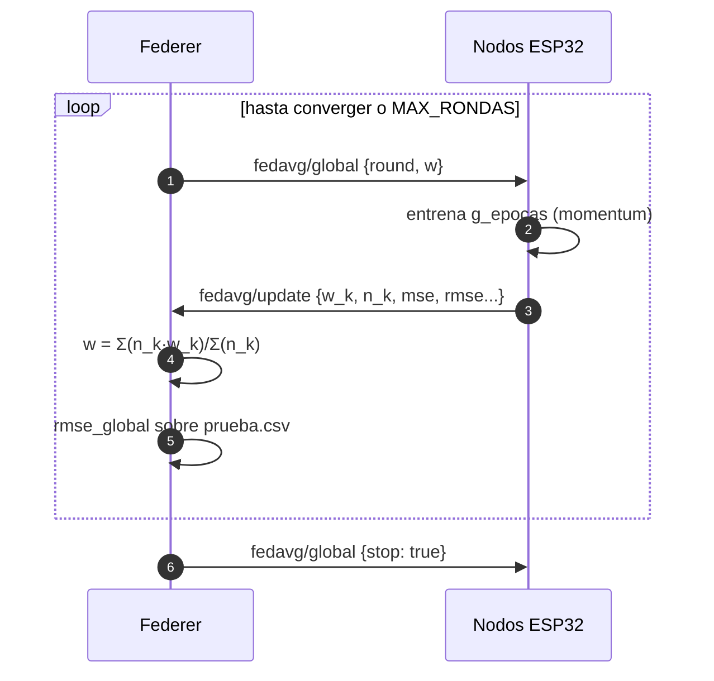

# Aprendizaje federado (FedAvg)

!!! info "Esta es la **Config A**"
    El modo `fedavg` es uno de los dos modos de entrenamiento de Federer. Para el modo
    descentralizado ve a [Gossip learning](gossip.md), y para una comparativa a
    [Modos de entrenamiento](modos.md).

Federer implementa **Federated Averaging (FedAvg)**: cada nodo entrena con sus propios datos y
el servidor promedia los pesos. Los datos crudos nunca salen del dispositivo. Es un modo
**reactivo y coordinado por un maestro**: los nodos solo entrenan cuando reciben el modelo
global.

## El modelo

El ejemplo es una **regresión lineal** con `N_FEATURES = 6` entradas y un sesgo, es decir
`N_PESOS = 7` parámetros:

$$ \hat{y} = w_0 x_0 + w_1 x_1 + \dots + w_5 x_5 + b $$

- **Entradas (`X`):** `N`, `P`, `temperatura`, `humedad`, `pH`, `lluvia`.
- **Objetivo (`y`):** potasio del suelo `K`.

## Entrenamiento local (en el ESP32)

Cada nodo ejecuta `g_epocas` épocas de **descenso de gradiente con momentum**:

$$ v \leftarrow \beta \, v - \eta \, \nabla L, \qquad w \leftarrow w + v $$

donde $\eta$ = `lr` (tasa de aprendizaje) y $\beta$ = `beta` (momentum). La pérdida es el
**error cuadrático medio (MSE)** sobre las muestras locales.

## Agregación (en el host)

Tras recibir los updates, Federer combina los pesos **ponderando por el número de muestras** de
cada nodo:

$$ w_{global} = \frac{\sum_{k} n_k \, w_k}{\sum_{k} n_k} $$

Así los nodos con más datos pesan más en el modelo global.

## El ciclo completo

## Criterio de convergencia

El entrenamiento se detiene cuando:

- se alcanza `MAX_RONDAS` (por defecto **30**), o
- el cambio del modelo entre rondas es pequeño: $\lVert \Delta w \rVert <$ `EPS_CONVERGENCIA`
  (por defecto `1e-3`).

Al terminar, Federer publica un mensaje `stop` en `fedavg/global`.

## Hiperparámetros

Puedes ajustarlos en caliente con el comando `config`:

| Parámetro | Símbolo | Defecto | Efecto |
|---|---|---|---|
| `lr` | $\eta$ | `0.01` | Tamaño del paso del gradiente. |
| `beta` | $\beta$ | `0.9` | Momentum; suaviza la trayectoria. |
| `epocas` | — | `5` | Épocas locales por ronda antes de reportar. |

## Constantes de orquestación (en `federer.py`)

| Constante | Defecto | Significado |
|---|---|---|
| `MAX_RONDAS` | `30` | Tope de rondas de entrenamiento. |
| `TIMEOUT_RONDA` | `30.0` s | Espera máxima por ronda para recibir updates. |
| `EPS_CONVERGENCIA` | `1e-3` | Umbral de convergencia sobre `‖Δw‖`. |
| `HEARTBEAT_TIMEOUT` | `15` s | Ventana para considerar un nodo online. |
