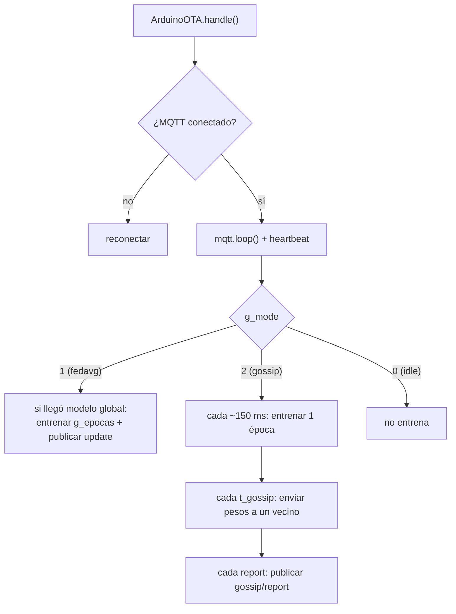

# Firmware del ESP32

El firmware del nodo (`firmware_esp32/src/main.cpp`, `FW_VER = 3.0-AB`) es **un solo binario con
dos modos de entrenamiento**: FedAvg (Config A) y gossip (Config B). Combina: agente de cluster
(MQTT), grabado por red (ArduinoOTA), entrenamiento local en ambos modos y reporte de métricas.

!!! info "Un firmware, dos modos"
    El nodo arranca en modo `fedavg` y cambia al recibir `cluster/mode`. Ver
    [Modos de entrenamiento](modos.md). No hace falta regrabar para alternar entre A y B.

## Proyecto PlatformIO

`firmware_esp32/platformio.ini` define dos entornos:

```ini
[env:esp32dev]                 ; PRIMERA grabacion: por USB
platform = espressif32
board = esp32dev
framework = arduino
monitor_speed = 115200
lib_deps =
    knolleary/PubSubClient@^2.8
    bblanchon/ArduinoJson@^7.0

[env:esp32ota]                 ; SIGUIENTES grabaciones: por red (OTA)
extends = env:esp32dev
upload_protocol = espota
upload_flags =
    --auth=federer            ; debe coincidir con OTA_PASS del firmware
```

- **`esp32dev`** → grabado por **USB** (primera vez).
- **`esp32ota`** → grabado por **red**; Federer pasa la IP del nodo con `--upload-port`.

## Estructura del firmware

| Sección | Función |
|---|---|
| `conectarWiFi()` | Une el nodo a la red Wi-Fi en modo estación. |
| `iniciarOTA()` | Habilita ArduinoOTA con hostname `esp32-nodo-<ID>` y clave `OTA_PASS`. |
| `conectarMQTT()` | Conecta al broker y se suscribe a control, datos y su buzón de gossip. |
| `entrenar_una_epoca()` | Una época de gradiente con momentum sobre los datos locales. |
| `gossipEnviar()` | (Config B) elige un vecino aleatorio y le manda sus pesos. |
| `gossipReporte()` | (Config B) publica su estado en `gossip/report`. |
| `onMessage()` | Despacha los mensajes MQTT entrantes según el tópico (incluye `cluster/mode` y el buzón de gossip). |
| `loop()` | Atiende OTA/MQTT, emite heartbeats y entrena según el modo activo. |

### Variable de modo

```cpp
// modos: 0=idle, 1=fedavg, 2=gossip
int g_mode = 1;
```

Lo cambia el mensaje `cluster/mode`. En gossip, además, se guardan los `peers`, los periodos
`t_gossip` / `report` y un momentum persistente `v_g[]`.

## Parámetros a editar

Al inicio de `main.cpp`:

```cpp
const char* WIFI_SSID = "TU_RED_WIFI";
const char* WIFI_PASS = "TU_PASSWORD";
const char* BROKER_IP = "192.168.1.100";   // IP del host/broker
const uint16_t BROKER_PORT = 1883;
const char* OTA_PASS  = "federer";          // clave de grabado por red
```

## La partición de datos: `datos_nodo.h`

Cada nodo incluye `firmware_esp32/include/datos_nodo.h`, **generado por Federer** al
provisionar. Define:

```cpp
#define NODE_ID     0
#define N_FEATURES  6
#define N_SAMPLES   110

const float FEAT_MEAN[N_FEATURES] = { ... };   // normalización
const float FEAT_STD[N_FEATURES]  = { ... };
const float X_LOCAL[N_SAMPLES][N_FEATURES] = { ... };
const float Y_LOCAL[N_SAMPLES] = { ... };
```

!!! warning "No edites este archivo a mano"
    Federer lo reescribe en cada `provision` y `ota`. Si lo cambias manualmente, se perderá en
    la siguiente grabación.

## Ciclo de vida en `loop()`

El comportamiento depende del modo activo:



- **Config A (fedavg):** reactivo. Solo entrena cuando recibe `fedavg/global`; ignora al maestro
  si está en gossip.
- **Config B (gossip):** autónomo. Tres relojes independientes (entrenar / enviar / reportar).
  Al recibir pesos de un vecino en su buzón `gossip/inbox/<ID>`, fusiona
  `w = (w + w_vecino) / 2`.

## Versionado del firmware

La constante `FW_VER` (`"3.0-AB"`) viaja en cada `announce` junto al campo `mode`, así puedes ver
en la tabla de nodos qué versión y en qué modo corre cada placa tras un despliegue OTA.
