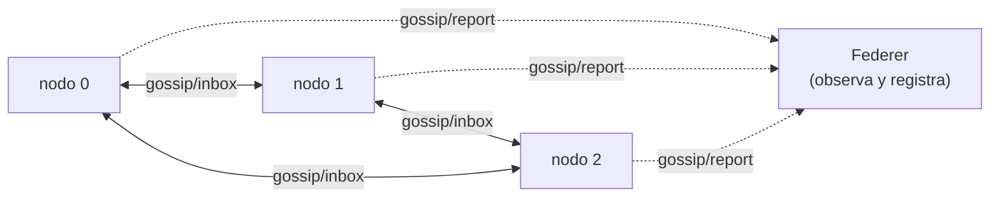

# Gossip learning (Config B)

En el modo **gossip**, los nodos aprenden **sin maestro**. Cada uno entrena de continuo con sus
datos y, periódicamente, elige un **vecino al azar** y le envía sus pesos; al recibir los de
otro, los **promedia con los suyos**. Con el tiempo, todos convergen al mismo modelo
(*consenso*).



A diferencia de [FedAvg](fedavg.md), Federer **no coordina** el entrenamiento: solo activa el
modo, observa los reportes y calcula métricas de consenso.

## Qué hace cada nodo

Mientras `mode = gossip`, en cada `loop()` el firmware ejecuta tres relojes independientes:

| Acción | Periodo | Efecto |
|---|---|---|
| **Entrenar** | `TRAIN_STEP_MS` (≈150 ms) | Una época de gradiente con momentum sobre los datos locales. |
| **Gossip** | `t_gossip` (configurable) | Elige un vecino aleatorio y publica sus pesos en `gossip/inbox/<id>`. |
| **Reportar** | `report` (configurable) | Publica su estado (`mse`, pesos, `exch`...) en `gossip/report`. |

Al recibir pesos de un vecino, el nodo fusiona:

$$ w_{local} \leftarrow \frac{w_{local} + w_{vecino}}{2} $$

y aumenta su contador de intercambios `exch`.

!!! note "Momentum persistente"
    En gossip el vector de momentum (`v_g`) se mantiene entre épocas, ya que el entrenamiento es
    continuo (no se reinicia en cada ronda como en FedAvg).

## Lo que hace Federer

El comando `train` → opción **B** ejecuta `train_gossip`:

1. Publica `cluster/mode` con `mode=gossip`, la lista de `peers` (nodos online), `t_gossip` y
   `report`.
2. Cada ~2 s toma una *instantánea* de los reportes recibidos y calcula:
    - el **RMSE local** de cada nodo contra `prueba.csv`,
    - el **RMSE promedio** del cluster,
    - la **dispersión** (qué tan lejos está cada nodo del modelo medio).
3. Al terminar el tiempo, publica `mode=idle` para que los nodos dejen de entrenar.

```text
federer> train
Configuracion a correr [A/B] (A): B
duracion (segundos) (60): 120
periodo de gossip por nodo (ms) (3000): 2500
gossip activo 120s (Ctrl+C para cortar antes)...
  t=  2.0s  RMSE_prom=40.81  dispersion=7.32  (4 nodos)
  t=  4.0s  RMSE_prom=33.10  dispersion=4.05  (4 nodos)
  ...
```

## Parámetros

| Parámetro | Dónde se fija | Significado |
|---|---|---|
| `duracion` | preguntado en `train` (B) | Segundos que dura el experimento de gossip. |
| `t_gossip` | preguntado en `train` (B) | Cada cuánto (ms) un nodo contacta a un vecino. |
| `report` | `enviar_modo` (2000 ms por defecto) | Cada cuánto reporta su estado a Federer. |
| `TRAIN_STEP_MS` | firmware (≈150 ms) | Cada cuánto entrena una época. |
| `peers` | calculado (nodos online) | Lista de vecinos candidatos para el gossip. |

## Convergencia y consenso

El gossip converge cuando todos los nodos coinciden en el modelo:

- **`rmse_prom`** debería **bajar** y estabilizarse.
- **`dispersion`** debería **tender a 0** (todos los pesos casi iguales = consenso alcanzado).

Ambas series se guardan en `gossip_consenso.csv`; el estado por nodo (incluido el número de
fusiones `exch`) en `gossip_nodos.csv`. Ver [Métricas](metrics.md).

## Tópicos MQTT involucrados

| Tópico | Dirección | Carga útil |
|---|---|---|
| `cluster/mode` | Federer → nodos | `{mode:"gossip", peers[], t_gossip, report}` |
| `gossip/inbox/<id>` | nodo → nodo | `{from, w[]}` |
| `gossip/report` | nodo → Federer | `{node, w[], mse, exch, heap, rssi}` |

Detalle completo en [Protocolo MQTT](mqtt.md).
