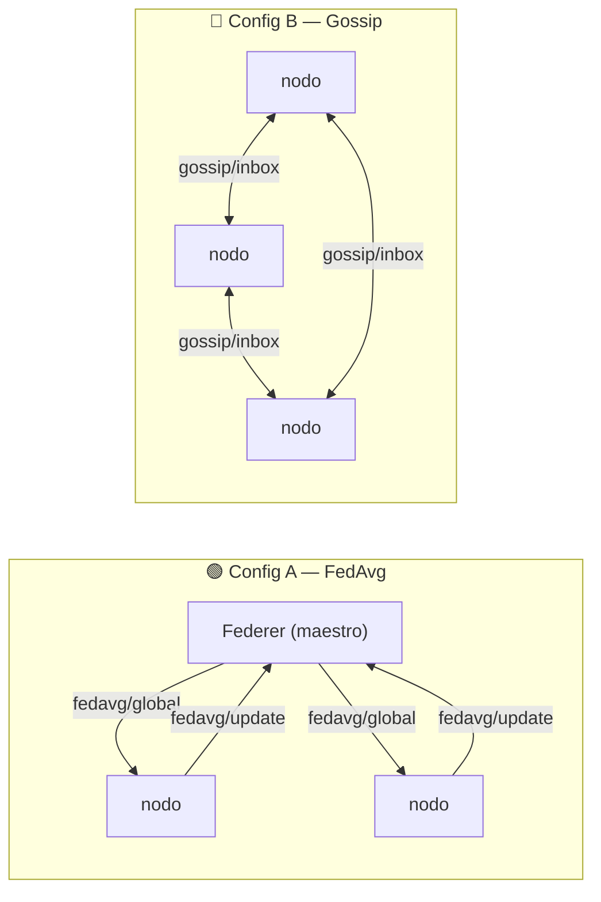

---
hide:
  - navigation
  - toc
---

<div class="fd-hero" markdown>


# Federer

<p class="tagline">
Plano de control tipo <code>kubectl</code> para un <strong>mini-cluster de ESP32</strong>
que entrena de dos formas: <strong>aprendizaje federado</strong> (FedAvg) y
<strong>gossip learning</strong>. Los datos nunca salen del dispositivo; solo viajan los
pesos del modelo. 🎾
</p>

<div class="fd-badges" markdown>


</div>

<div class="fd-cta" markdown>
[Empezar ahora :material-rocket-launch:](getting-started.md){ .md-button .md-button--primary }
[Ver en GitHub :fontawesome-brands-github:](https://github.com/Vallit0/federer){ .md-button }
</div>

</div>

---

## ¿Qué es Federer?

**Federer** convierte un puñado de placas **ESP32** en un **cluster de aprendizaje distribuido
en el borde**. En lugar de centralizar los datos, **cada placa entrena un modelo localmente** y
solo comparte los *pesos*. Federer es el plano de control: descubre nodos, les envía
hiperparámetros, **elige el modo de entrenamiento**, los graba **por red (OTA)** y registra
todas las métricas en CSV.

El mismo firmware soporta **dos modos**, conmutables con un solo mensaje MQTT:

<div class="fd-grid" markdown>

<div class="fd-card" markdown>
<span class="fd-icon">🟢</span>
### Config A — FedAvg
**Aprendizaje federado.** Un maestro coordina cada ronda: difunde el modelo, los nodos entrenan
y devuelven pesos, el host los promedia. [Saber más →](fedavg.md)
</div>

<div class="fd-card" markdown>
<span class="fd-icon">🔵</span>
### Config B — Gossip
**Gossip learning.** Sin maestro: cada nodo entrena de continuo y fusiona sus pesos con un
vecino aleatorio. Robusto y descentralizado. [Saber más →](gossip.md)
</div>

</div>

El ejemplo incluido es una **regresión lineal** sobre el dataset *Crop Recommendation*: cada
nodo predice el potasio del suelo (**K**) a partir de `N`, `P`, `temperatura`, `humedad`, `pH`
y `lluvia`.

---

## ¿Por qué Federer?

<div class="fd-grid" markdown>

<div class="fd-card" markdown>
<span class="fd-icon">🛰️</span>
### Control tipo `kubectl`
Descubre, inspecciona y administra todos tus nodos desde un menú interactivo en la terminal.
</div>

<div class="fd-card" markdown>
<span class="fd-icon">🔀</span>
### Dos modos, un firmware
FedAvg y gossip viven en el mismo binario; cambias de uno a otro sin regrabar.
</div>

<div class="fd-card" markdown>
<span class="fd-icon">🖥️</span>
### Panel web ligero
Una UI estilo Docker Desktop / Airflow para ver y configurar todo desde el navegador.
[Saber más →](web-ui.md)
</div>

<div class="fd-card" markdown>
<span class="fd-icon">📡</span>
### Grabado OTA
Actualiza el firmware de los ESP32 **por Wi-Fi**, sin volver a conectar el cable USB.
</div>

<div class="fd-card" markdown>
<span class="fd-icon">📊</span>
### Telemetría en vivo
Heap, RSSI, MSE/RMSE, tiempo de entrenamiento y consenso de gossip, exportados a CSV.
</div>

<div class="fd-card" markdown>
<span class="fd-icon">🔌</span>
### Provisión automática
Genera la partición de datos de cada nodo y graba el firmware con un solo comando.
</div>

<div class="fd-card" markdown>
<span class="fd-icon">🔒</span>
### Privacidad por diseño
Los datos crudos nunca abandonan la placa; solo se transmiten los parámetros del modelo.
</div>

</div>

---

## Vistazo rápido

```bash
# 1. Instalar dependencias
pip install -r requirements.txt

# 2. Levantar el broker MQTT (Mosquitto en localhost:1883)
#    Linux: sudo systemctl enable --now mosquitto

# 3. Lanzar Federer
python federer.py
```

```text
 7) train      correr experimento (A=FedAvg / B=gossip)
Configuracion a correr [A/B] (A):
```

¿Listo para montar tu cluster? Sigue la guía de
[**instalación y setup**](getting-started.md) y compara los
[**modos de entrenamiento**](modos.md).

---

## Los dos modos, de un vistazo



Profundiza en [**Modos de entrenamiento**](modos.md), [**FedAvg**](fedavg.md) y
[**Gossip learning**](gossip.md).
